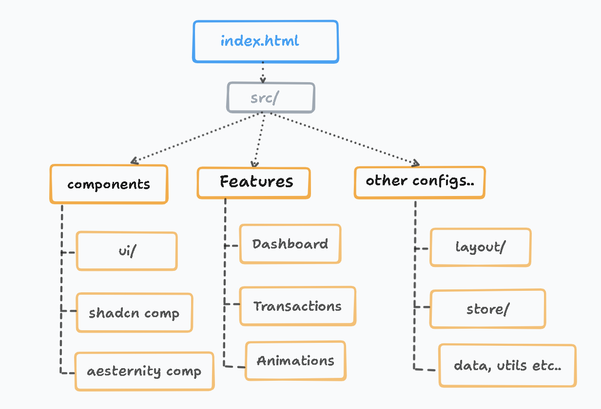

# Findash

A clean, minimal finance dashboard to track spending, income, and cash flow at a glance.

**Live** -- https://findash.0bhishek.tech/

**Demo** --

---

## Features

- Summary cards for income, expenses, savings with trend indicators
- Cash flow chart with daily, weekly, and yearly views
- Pie chart breakdown of balance distribution
- Transaction table with search, filters, date range, and pagination
- Add, edit, delete transactions with smooth animations
- CSV export
- Dark and light theme
- Persistent state across sessions
- Undo support for destructive actions
- Skeleton loaders for perceived performance

---
## Folder Structure Diagram



---
## Folder Structure

```
src/
  components/ui/   -- reusable UI primitives (shadcn based)
  features/
    dashboard/     -- charts, summary cards, stats
    transactions/  -- table, pagination, export, animations
  layouts/         -- page layout wrapper
  store/           -- zustand state management
  data/            -- mock financial data
  utils/           -- formatting and color helpers
  assets/          -- static images
```

---

## Tech Stack

React 19, TypeScript, Vite, Tailwind CSS 4, Recharts, Radix UI, Zustand, Motion, date-fns

---

## Getting Started

```bash
git clone https://github.com/iCoderabhishek/findash.git
cd findash && bun i && bun dev
```

---

## Inspirations and Resources

- [Shadcn UI](https://ui.shadcn.com/) -- component system
- [Aceternity](https://aceternity.com/) -- design inspiration
- [Recharts](https://recharts.org/) -- charting library
- [Zustand](https://zustand.docs.pmnd.rs/) -- state management
- [Dribbble finance dashboards](https://dribbble.com/search/finance-dashboard) -- design reference
- [Radix Primitives](https://www.radix-ui.com/) -- accessible UI primitives
